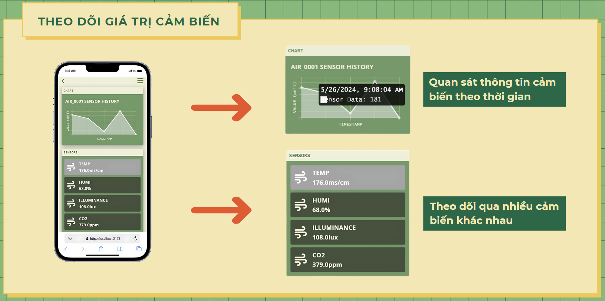
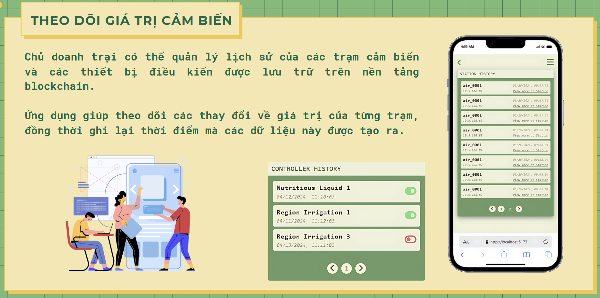
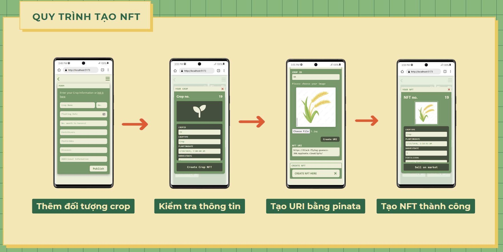
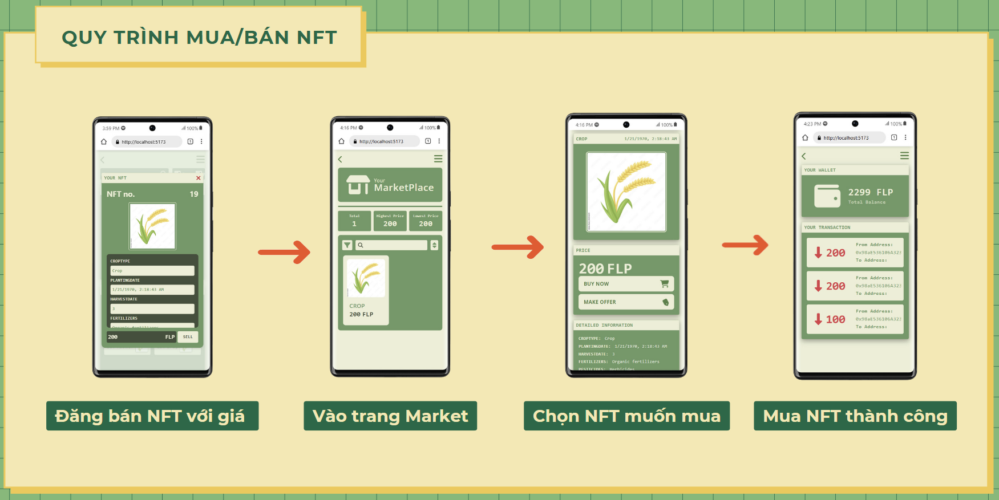
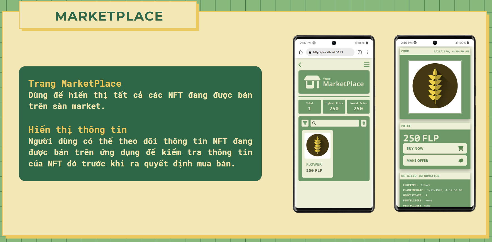

# Introduction
- This Blockchain-based application designed to enhance transparency, traceability, and efficiency in agricultural supply chains. 
- This client application allows users to interact with the system, manage crops, monitor environmental data, and perform secure transactions.
# Technologies Used
- **Frontend**: HTML, TailwindCSS, CSS, JavaScript
- **Blockchain**: Ethereum, Smart Contracts (Solidity)
- **Libraries and Frameworks**:
  - React for UI development
  - Ethers.js for interacting with Ethereum blockchain

# Requirements: 
- Node.js (>=14.x)
- npm (>=6.x)
- MetaMask extension for interacting with the Ethereum blockchain

## How to install:
```
npm install
```
## How to run:
```
npm run dev
```

# Features:
## Device Monitor:




## NFT Transaction:




## Market Features:

